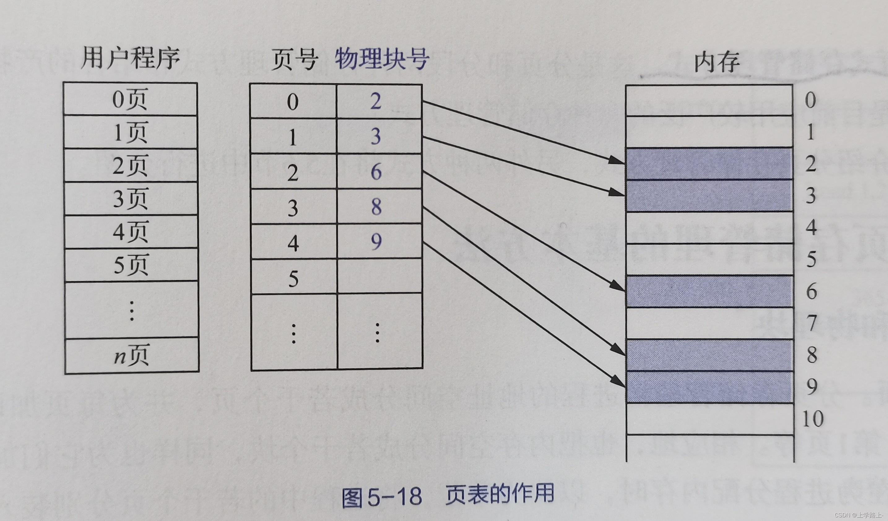

# Linux 虚拟内存与物理内存

## 1.物理内存

物理内存是计算机中真正存储数据的硬件设备，即主板上的内存条。

- 作用：
  - 存放当前正在运行程序的指令和数据。
  - 缓存磁盘内容，加快文件读写。

- 特点：
  - 容量有限：物理内存大小固定，例如 4GB、8GB 等。物理内存不足时，操作系统必须借助 swap（把不常用的页面放到磁盘上暂时存储的区域） 或其他机制才能继续运行程序。
  - 易失性：断电后数据会丢失，因此不适合作长期存储。
  - 共享性：所有进程共享同一块物理内存。

- 局限性
  - 容量受限：大型程序可能一次性需要数十 GB 内存，但物理内存不够。
  - 碎片问题：频繁分配和释放内存可能导致内存碎片，降低可用性。
  - 安全问题：程序之间直接共享物理内存容易互相覆盖。
  - 硬件依赖：程序必须根据硬件地址操作内存，移植性差。

---

## 2.虚拟内存

虚拟内存是操作系统为每个进程提供的、独立的、连续的 “假象内存空间”。
它让每个进程以为自己拥有一块大的、不受干扰的独立内存。

- 特点：
  - 每个进程独享虚拟地址空间，不同进程之间不会互相干扰。
  - 虚拟内存看起来连续，但实际上可能映射到分散的物理内存
  - 大小通常远大于物理内存（例如 128TB 虚拟空间 → 只有 16GB 物理内存）
  - 虚拟内存只是“地址”，它本身不存储数据。


在 Linux 中，每个进程看到的虚拟地址空间大致如下：

```
高地址
+--------------------------+ 
|           栈             | ← 保存函数调用帧、局部变量、参数、返回地址
|        (向下增长)         |
+--------------------------+
|           堆             | ← malloc 分配的动态内存
|        (向上增长)         |
+--------------------------+
|        BSS 段            | ← 未初始化全局变量（默认初值=0）
+--------------------------+
|        Data 段           | ← 已初始化的全局变量、静态变量
+--------------------------+
|        Text 段           | ← 程序的机器指令，只读，来自可执行文件
+--------------------------+
|       内核空间            | ← 内核保留区域，用户态不可访问
+--------------------------+
低地址
```
---

比较：

| 属性        | 物理内存       | 虚拟内存          |
| --------- | ---------- | ------------- |
| 是否真实存数据？  | ✔ 是        | ❌ 只是地址，不存数据   |
| 位置        | 硬件（RAM）    | MMU（内存管理单元） 提供的抽象空间   |
| 每个进程是否独立？ | ❌ 所有进程共享   | ✔ 每个进程独享      |
| 容量        | 固定（如 8GB） | 非常大（如 128TB）  |
| 是否可扩展？    | ❌ 限于硬件     | ✔ 借助 swap 可扩展 |

## 3.为什么需要虚拟内存？

### 问题

如果一个程序 直接访问物理内存 会发生什么问题？

- 程序之间容易互相覆盖内存导致崩溃
  - 一个程序写错地址就可能覆盖其他程序的数据
- 程序需要连续大内存很难满足（碎片问题）
  - 物理内存的可用空间是零散分布的，如果程序需要例如 500MB 连续内存，物理内存很可能找不到一整块连续空间。
- 程序地址需要跟物理硬件紧密绑定，不好写程序
- 不能让程序使用超过物理内存条的空间

### 虚拟内存的意义
  
虚拟内存是操作系统为每个进程提供的、与实际物理内存**无关的、独立的、连续的大型**地址空间。它把复杂的物理内存管理问题抽象掉，让程序看到一个简单、规则、统一的内存世界。

本质上，虚拟内存是一种抽象层，并不是实际存在的硬件空间，而是操作系统结合 CPU MMU（内存管理单元）一起模拟出来的。

> 程序看到的内存（虚拟） ≠ 真实内存（物理）

虚拟内存让每个程序拥有一个独立、安全、连续、比物理内存大得多的地址空间，解决了内存碎片、安全隔离、内存不足等问题。

---

## 4. Linux 如何把虚拟内存映射到物理内存？

Linux 使用 **分页机制** 来管理虚拟内存和物理内存。分页机制将虚拟内存和物理内存都划分为固定大小的块，使得虚拟地址到物理地址的映射能够高效、安全地进行。核心概念是：

> **虚拟地址 → 页表 → 物理页框**  

当程序访问的虚拟地址没有对应物理页时，会触发 **缺页异常**，操作系统再为其分配物理页，并更新页表映射。

分页机制不仅解决了连续内存分配的碎片问题，还为内存保护、按需分配、大虚拟空间提供了基础支持。

---

## 页

### 1. 页的概念
页是 Linux 系统中虚拟内存和物理内存管理的**最小单位**。  
- 操作系统把虚拟内存划分为固定大小的虚拟页，同时把物理内存划分为等大小的物理页框。  
- 默认页大小通常为 **4KB**，但在一些系统中，也支持大页（2MB 或 1GB）。  
- 每页包含连续的虚拟地址，但物理内存页框不必连续。

> 页的大小类似于城市中的“地块”，每个地块可以存放固定面积的建筑。虚拟页和物理页就像地块的规划，虚拟页看似连续，物理页可以分散，但通过“地图”（页表）可以找到对应位置。

---

### 2. 页的作用
分页不仅是内存管理单位，更有多重作用：

1. **内存隔离与安全**  
   - 每个进程拥有独立的虚拟页空间，进程之间无法直接访问对方的内存  
   - 防止程序越界访问引发系统崩溃或数据泄漏  

2. **减少碎片**  
   - 物理内存不必连续，避免传统连续分配产生的外部碎片  
   - 内核可以把物理页分散分配，同时虚拟页对程序来说是连续的  

3. **按需分配**  
   - 内核在程序访问虚拟页时才分配物理页  
   - 未访问的虚拟页不占用物理内存，提高整体内存利用率  

4. **支持大虚拟地址空间**  
   - 程序看到的虚拟地址空间通常远大于物理内存  
   - 依赖 swap 或按需分配机制，可以让程序申请超过物理内存的空间  

---

### 3. 页的映射示例
假设一个进程申请 **8KB** 内存：  

- 虚拟地址空间被划分为两页，每页 4KB  
- 操作系统为这两页分配物理页框（可能不连续），并建立映射  
- 程序访问虚拟地址 `0x1000` 时 → 页表映射到物理页 #50  
- 程序访问虚拟地址 `0x2000` 时 → 页表映射到物理页 #201  

> 注意：虽然虚拟地址连续，但物理页可能分散，分页机制让程序感知不到物理内存的碎片。

---

## 页表

### 1. 页表概念
页表是操作系统维护的 **虚拟页到物理页的映射表**。  
每个进程都有自己的页表，记录虚拟页对应的物理页号、访问权限、状态信息等。CPU 内存管理单元通过页表将虚拟地址转换为物理地址，实现虚拟内存访问。


---

### 2. 多级页表
直接建立单级页表会占用巨大的内存空间，尤其在 64 位系统中。  
Linux 采用 **多级页表** 结构来降低开销：

- 64 位系统通常使用 **4 级或 5 级页表**  
- 每级页表只管理虚拟地址的一部分
- 最终映射到物理页框  

#### 优势：
- 节省内存：未使用的虚拟页无需占用页表空间 ，只有实际使用的虚拟地址区域才需要创建下级页表。 
- 支持稀疏分配：只为访问过的页建立页表条目 ，虚拟空间很大，但未使用的地址不占内存。
- 按需分配页表：当进程访问新的虚拟地址时，才会创建对应的页表条目。 

```
虚拟地址空间
+-------------------------+
| 虚拟页 0               |
+-------------------------+
| 虚拟页 1               |
+-------------------------+
| 虚拟页 2               |
+-------------------------+
| 虚拟页 3               |
+-------------------------+

       │
       ▼  一级页表索引 (Page Directory)
+-------------------------+
| PDE0 → 指向二级页表0   |
| PDE1 → 指向二级页表1   |
| PDE2 → 指向二级页表2   |
| PDE3 → 指向二级页表3   |
+-------------------------+

       │
       ▼  二级页表索引 (Page Table)
+-------------------------+
| PTE0 → 物理页框 #10    |
| PTE1 → 物理页框 #22    |
| PTE2 → 物理页框 #45    |
| PTE3 → 物理页框 #18    |
+-------------------------+

       │
       ▼  物理页框 + 页内偏移
+-------------------------+
| 物理页框 #10            |
+-------------------------+
| 物理页框 #22            |
+-------------------------+
| 物理页框 #45            |
+-------------------------+
| 物理页框 #18            |
+-------------------------+
```

---

### 3. 页表条目内容
每个页表条目保存的信息包括：

- 物理页框号  
- 访问权限（读/写/执行）  
- 页状态（是否在物理内存、是否修改过）  
- 缓存策略（是否可缓存、是否写回）  

通过这些信息，CPU 可以快速将虚拟地址映射到物理地址，并进行访问权限检查。

---

## 分页机制

分页的三个流程：

1. 程序的虚拟地址被划分为虚拟页  
2. 内核为虚拟页分配物理页框  
3. 页表记录虚拟页 → 物理页的映射关系  

分页机制带来的优势：

- **内存隔离**：防止进程互相干扰  
- **减少碎片**：物理内存不必连续  
- **支持大虚拟空间**：超出物理内存大小  
- **按需分配**：节省内存，提高利用率  

> 分页机制是虚拟内存管理的基石，也是现代操作系统内存管理的核心设计。

---
### 缺页异常

当进程访问某个虚拟地址时，如果该虚拟页还没有对应的物理页，就会触发 **缺页异常**。这是操作系统按需分配物理内存的关键机制。
流程：

1. **CPU 查询页表**  
   - CPU 访问虚拟地址时，首先通过 **MMU（内存管理单元）** 查页表。  
   - 页表中记录虚拟页对应的物理页框信息以及访问权限。  
   - 如果页表条目的 **Present 位** 为 0，表示该虚拟页当前没有映射到物理页。  
   - 这时，CPU 会立即触发 **缺页异常中断**，暂停当前指令执行，并转入内核异常处理程序。

2. **内核判断访问是否合法**  
   - 内核根据当前进程的虚拟内存布局判断访问是否有效。  
   - **合法访问**：
     - 访问地址在进程合法的虚拟内存范围内（如堆、栈）。  
     - 内核会为该虚拟页分配空闲的物理页框，并将页表条目更新为新的物理页映射，同时设置访问权限和状态标志。  
   - **非法访问**：
     - 访问地址不在进程允许的虚拟内存范围内（如访问空指针或越界地址）。  
     - 内核会触发 **Segmentation Fault（段错误）**，通常导致进程被终止。

3. **物理页分配与页表更新**  
   - 内核从空闲物理页池中选择一页或多页物理内存（页框）进行分配。  
   - 内核将新分配的物理页号写入页表条目，并将 Present 位置 1，同时设置访问权限（可读/可写/可执行）和状态位。  

4. **程序继续执行**  
   - 更新完页表后，CPU 会重新执行刚才触发异常的指令。  
   - 后续访问该页不再触发缺页异常。

> 注意：**物理内存大多数是在缺页时分配**。  
> 这就是按需分配的核心思想：虚拟地址空间可以先保留，而物理页只有在实际访问时才分配，提高内存利用效率。

---

### 缺页异常示意图

```
程序访问虚拟地址
    ↓
CPU 查页表
    ↓
没有映射？ → 是 → 触发 缺页异常
    ↓
内核判断是否合法访问
    是      否 → 段错误
    ↓       
分配物理页更新页表
    ↓
程序继续执行
```
---

### 总结

- Linux 使用 **分页机制** 将虚拟内存映射到物理内存  
- **页** 是内存管理的最小单位，提供隔离、按需分配和碎片控制  
- **页表** 记录虚拟页与物理页的映射，并管理权限  
- **多级页表** 节省内存开销，支持稀疏分配 
- **缺页异常** 是物理页分配的触发机制  
- **按需分配** 让虚拟内存空间可以远大于物理内存，提高系统效率和灵活性


## 5.malloc 与虚拟内存、物理内存的关系

在 C 语言中，malloc 是动态内存分配的标准函数。它允许程序在运行时请求一块指定大小的内存。然而，malloc 并不直接分配物理内存，它只涉及虚拟内存的管理。

当你写：

```c
p = malloc(2025);
```
malloc 的处理流程：
1.检查堆空间是否足够
- 如果堆中已有空闲块，malloc 直接返回该地址
注意：这时并不涉及物理内存，只是虚拟地址空间的分配
2.堆空间不足时，向内核申请虚拟地址
- malloc 调用系统调用 brk（调整程序堆末尾地址），内核为程序分配一段新的虚拟地址区域

注意：`malloc` 并不会分配物理内存。

### 🔹 什么时候分配物理内存？

当你 **第一次访问** 这片区域：

```c
p[0] = 1;
```

发生了以下过程：

1.触发缺页异常
- CPU 查询页表时发现对应的虚拟页没有物理页映射
- 因此触发 缺页中断，让操作系统介入

2.内核分配物理页
- 内核从空闲物理页池中分配一页或多页物理内存

3.建立虚拟页 → 物理页映射
- 内核更新进程的页表
- 虚拟地址和实际物理页之间建立映射
- 后续访问这段内存直接命中页表，无需再触发缺页异常，表本身也存储在主内存

4.完成访问
- 程序继续执行
- malloc 返回的虚拟地址现在对应实际物理内存

这种按需分配机制使得程序可以申请大块虚拟内存，而物理内存只在实际访问时使用，大大提高了内存利用率。

---

## 整体流程图

```
malloc(size)
    ↓
检查堆中是否有空闲块
    ↓
如果堆足够 → 返回虚拟地址（物理内存未分配）
    ↓
如果堆不足 → 调用 brk / mmap 向内核申请虚拟地址
    ↓
分配到虚拟地址空间（仍然没有物理页）
    ↓
程序第一次访问虚拟地址
    ↓
CPU 查页表 → 触发缺页异常
    ↓
内核分配物理页
    ↓
更新页表，建立虚拟页 → 物理页映射
    ↓
程序继续执行，访问命中页表
    ↓
后续访问直接使用物理页，无需再次触发缺页异常
```

通过这个流程可以看到，malloc、虚拟内存和物理内存实际上是三个不同的层次：

- malloc 负责 虚拟地址分配
- 虚拟内存负责 地址映射、隔离与安全
- 物理内存负责 真实存储数据
---

## 总结

- 程序看到的是 **虚拟内存**，而不直接操作物理内存  
- 虚拟内存让程序觉得有 **连续、安全、超大空间**  
- 内核通过 **页 + 页表** 来管理虚拟页到物理页的映射  
- `malloc` 只分配 **虚拟内存地址空间**，不分配物理内存  
- **物理内存** 只有在程序第一次访问该虚拟地址时才分配（触发缺页异常）  
- 分页机制让内存管理更加 **高效、灵活、隔离安全**  
- 大块内存可通过 `mmap` 映射到独立虚拟空间，避免堆碎片  
- 多级页表和按需分配减少内存开销，提高物理内存利用率
